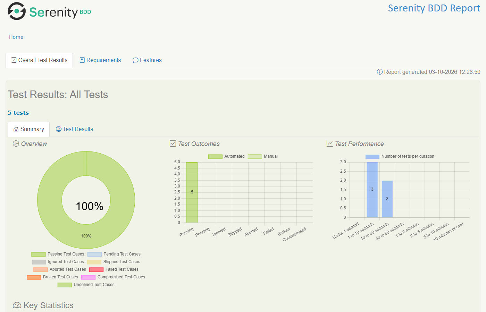

# Demoblaze E2E: API + UI test automation

End-to-end test automation for the [Demoblaze](https://www.demoblaze.com) demo store. The REST API is tested with **Karate** and the website with **Serenity BDD Screenplay + Cucumber**, in one Gradle build. Both suites run in CI, and every merge publishes both reports.

[](https://github.com/LeixerM/Proyecto_DemoBlaze_E2E/actions/workflows/tests.yml)


**Live reports:** https://leixerm.github.io/Proyecto_DemoBlaze_E2E/ ([API](https://leixerm.github.io/Proyecto_DemoBlaze_E2E/karate/) · [UI](https://leixerm.github.io/Proyecto_DemoBlaze_E2E/serenity/))



## Why one repo: UI + API on the same product

- **Each layer tests what it is good at.** Business rules and error messages are checked quickly through the API. The UI suite covers only what a user actually experiences in the browser.
- **API for setup, UI for behaviour.** The login scenario creates a fresh account through the API, then logs in through the website. This is faster and more reliable than signing up through the UI, and it proves both layers agree. For example, the site Base64-encodes passwords before calling the API.
- **One pipeline, one view.** The API suite runs first and the UI suite second. Both reports are published side by side.

## What is tested

### API (Karate), 11 scenarios

| Feature | Scenario | What it proves |
|---|---|---|
| Sign up | A new user signs up with a unique username | Usernames are UUID-based, so runs never collide |
| | Signing up twice with the same username is rejected | Error body `{"errorMessage": "This user already exist."}` |
| Log in | A registered user logs in and receives an auth token | Body matches `Auth_token: <base64>` and the token decodes to the username |
| | Wrong password / unknown username | Error bodies `Wrong password.` / `User does not exist.` |
| Catalog | `/entries` matches the product schema | Every item has typed `id`, `title`, positive `price`, known `cat`, image path |
| | `/view` returns one product | Schema plus the exact product data |
| | `/bycat` for phone, notebook, monitor (Scenario Outline) | Only products of that category come back |
| | `/view` with an unknown id | `{"errorMessage": "Not found."}` |

Demoblaze returns **HTTP 200 even for errors**, so every scenario asserts the response body, not only the status code.

### UI (Serenity BDD Screenplay), 5 scenarios

| Feature | Scenario | What it proves |
|---|---|---|
| Purchase | A guest buys two products and receives a matching receipt | Cart lists the products. Total = sum of catalog prices. The receipt's id, amount, card, name and date are each checked separately. |
| | The order form requires a name and a credit card | Validation alert text |
| Cart | Removing a product updates the cart contents and the total | Contents and total after a delete |
| Log in | A user registered through the API logs in on the website | API-then-UI flow, welcome message shows the username |
| | A wrong password is rejected on the website | Alert text `Wrong password.` |

Plus 7 JUnit unit tests for receipt parsing and credential encoding.

> Known site defect, pinned on purpose: the receipt prints the month zero-based (October → `9`) because the site uses JavaScript's `Date.getMonth()`. The expected value is computed by `PurchaseReceipt.dateAsPrintedBySite`, so a fix on the site shows up as a visible test change.

## Project structure

```
.
├── api-tests/                         Karate module
│   └── src/test
│       ├── java/demoblaze/api/        DemoblazeApiTest: JUnit 6 runner, one test per scenario
│       └── resources
│           ├── karate-config.js       Base URL and settings from -D props / env vars, safe defaults
│           └── demoblaze/api
│               ├── auth/              signup.feature, login.feature
│               ├── catalog/           catalog.feature
│               ├── common/            new-user.feature: reusable "create a fresh user" helper
│               └── schemas/           product.json: fuzzy-match schema
├── ui-tests/                          Serenity BDD Screenplay module
│   └── src
│       ├── main/java/demoblaze/ui
│       │   ├── tasks/                 OpenTheStore, AddToCart, OpenTheCart, RemoveFromCart, PlaceTheOrder, LogIn, RegisterAnAccount
│       │   ├── interactions/          AcceptTheAlert: waits for, records and accepts native alerts
│       │   ├── questions/             TheCart, ThePurchaseConfirmation, TheStore, TheApiResponse
│       │   ├── ui/                    Targets (locators) per page or modal
│       │   ├── models/                Customer, Credentials, PurchaseReceipt
│       │   └── data/                  StoreData: reads data/store.json
│       └── test
│           ├── java/…/runners/        JUnit Platform Suite + Cucumber engine + Serenity reporter
│           ├── java/…/stepdefinitions Thin glue: Gherkin → tasks and Ensure assertions
│           └── resources/             features/*.feature, data/store.json, serenity.conf
├── .github/workflows/tests.yml        CI: API → UI → reports → GitHub Pages
└── docs/regression-baseline.md        What the original projects did and how it maps here
```

Design choices:

- **Screenplay:** actors with two abilities (`BrowseTheWeb`, `CallAnApi`) perform tasks built from interactions, and check outcomes with questions.
- **Readable failures:** one `Ensure` per receipt field instead of one combined boolean, so a failure names the field and shows expected and actual values.
- **No `Thread.sleep`:** `WaitUntil` on targets that only match the expected state, such as a cart row for a specific product, or the welcome link only after the post-login reload.
- **No shared state:** every scenario creates its own user, and every browser session gets its own anonymous cart.
- **No secrets in the code:** test accounts are generated per run. URLs come from `serenity.conf` and `karate-config.js` and can be overridden with system properties or environment variables.

## Run locally

Requirements: JDK 21 and Google Chrome. Selenium Manager resolves the driver automatically.

```bash
./gradlew clean test aggregate                        # both suites + reports
./gradlew :api-tests:test                             # API only
./gradlew :ui-tests:test :ui-tests:aggregate -Dcucumber.filter.tags="@purchase"   # UI, one feature
./gradlew :api-tests:test -Ddemoblaze.apiUrl=https://api.demoblaze.com           # override a setting
```

Reports:

- API: `api-tests/build/karate-reports/karate-summary.html`
- UI: `ui-tests/target/site/serenity/index.html` (Chrome runs headless; remove `headless=new` in `serenity.conf` to watch it)

## Continuous integration

[`.github/workflows/tests.yml`](.github/workflows/tests.yml):

- Runs on every push to `main`, every pull request and on demand (optionally with a Cucumber tag expression for the UI suite).
- Java 21 (Temurin), Gradle cache, headless Chrome.
- Runs the API suite first, then the UI suite. The UI suite still runs if the API suite fails, so both reports always exist.
- Uploads both reports as one build artifact on every run.
- On pushes to `main`, publishes a small landing page linking to `karate/` and `serenity/` on GitHub Pages.

## Author

Leixer Molina, QA Engineer · [Portfolio](https://leixerm.github.io/) · [LinkedIn](https://www.linkedin.com/in/leixer-molina/)
